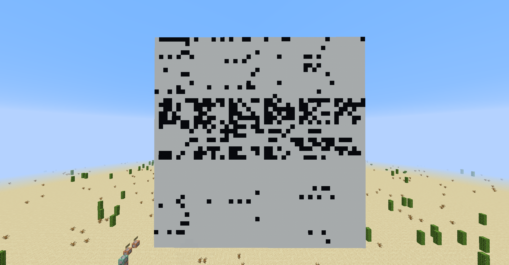

# MCnu

Rev 

### Description
Do me a favor and meditate on the possibilities after you've solve this. 
I also would love to see a solution using mc86 itself... 
[Challenge source](https://gist.github.com/AndyNovo/6c6318393631e8ac6f999ef6aa1a7c07)  
Our mc86 problems introduce a new vanilla Minecraft CPU (java edition). 
It helps to have Java Edition Minecraft but if you don't they can still be solved the old fashioned way. 
Here is a video introducing the architecture and the book to build the CPU: 
[mc86 Intro on YouTube](https://www.youtube.com/watch?v=mqOSgJ0NM_Q) 
[mc86 init book](https://gist.github.com/AndyNovo/657ff15b7614f70e34f7295cb3dd7a8f) 
Author: ProfNinja

   

### Solution

#### Extracting code
First, we read the code and realise that there is a whole chunk that does not get used 
We extract it and format it in Sublime Text, before copying it to a Minecraft Book 

#### Getting the binary
First, we run the book and notice that it generates a wall of white and black concrete  
 
We also get a hint that it is an ELF file, and that the header is \x7fELF, and that it translates to 0111 1111 in binary 
We look and confirm that indeed, the white concrete represents 0 and black concrete represents 1 
Thus, we create a [python script](./Assets/MCnu.py) to "rebuild" the structure in 1s and 0s 

#### Changing to .ELF
We then take the binary output, and convert it to hex 
We use a hex editor to create the [.ELF file](./Assets/mcnu.elf), and from there, we run it to get the flag

 
> UDCTF{yall_w0rk3d_h4rd_4_it}