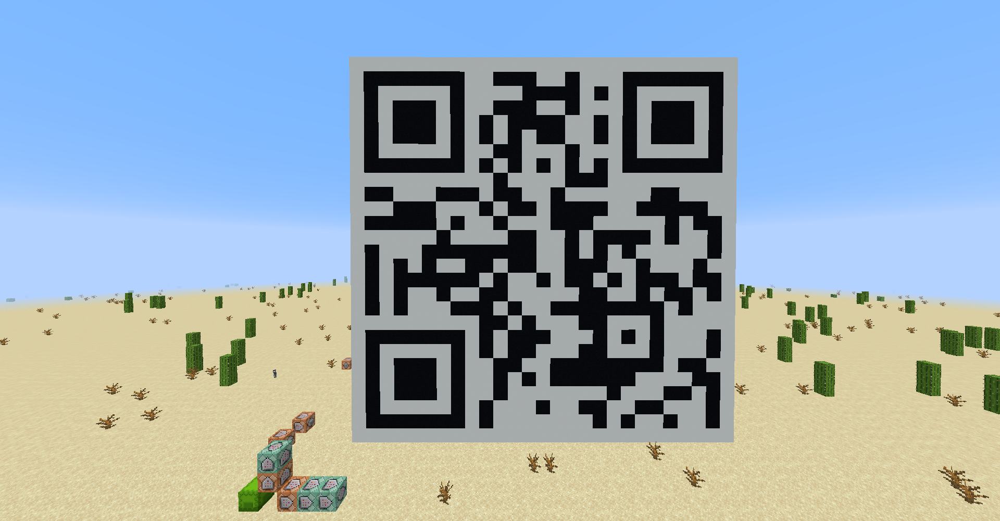
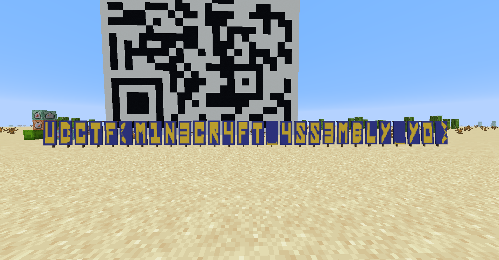

# MineR Code

Minecraft 

### Description
Start here for your intro to mc86, we hope you enjoy. 
[Challenge source](https://gist.github.com/AndyNovo/09b114c835d82ca136faa3e59f930f6e) 
(It's a 0 not an O)  
Our mc86 problems introduce a new vanilla Minecraft CPU (java edition). 
It helps to have Java Edition Minecraft but if you don't they can still be solved the old fashioned way. 
Here is a video introducing the architecture and the book to build the CPU: 
[mc86 Intro on YouTube](https://www.youtube.com/watch?v=mqOSgJ0NM_Q) 
[mc86 init book](https://gist.github.com/AndyNovo/657ff15b7614f70e34f7295cb3dd7a8f) 
Author: ProfNinja

   

### Solution
Run the book to get a QR code 
 
Scanning the QR code brings us to [this site](https://gist.github.com/AndyNovo/30aa5b2665aa388dc81545f79ccb380f) 
We get another book to run, and it gives us the flag 
 
 
> UDCTF{M1N3CR4FT_4SS3MBLY_Y0}