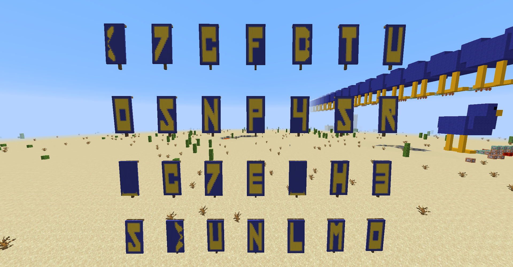

# Mixed Columns

Minecraft 

### Description
I was pleased at how much more I enjoy this cipher in an immersive world. 
[Challenge source](https://gist.github.com/AndyNovo/6e961ce5facd64417543ac9809658085) 
(FORMAT: we're using [5S] and [0O] at the ambiguous spots)  
Our mc86 problems introduce a new vanilla Minecraft CPU (java edition). 
It helps to have Java Edition Minecraft but if you don't they can still be solved the old fashioned way. 
Here is a video introducing the architecture and the book to build the CPU: 
[mc86 Intro on YouTube](https://www.youtube.com/watch?v=mqOSgJ0NM_Q) 
[mc86 init book](https://gist.github.com/AndyNovo/657ff15b7614f70e34f7295cb3dd7a8f) 

   

### Solution
Running the book gives us a few columns of letters  
  
Noting that the flag format is "UDCTF{...}", we figure out that the columns are mixed in the order 6, 7, 3, 5, 2, 4, 1 
Thus, we get each character according to the order, and we are able to get the flag 
 
> UDCTF{7R4NSP0S3_7HE_C0LUMN5}