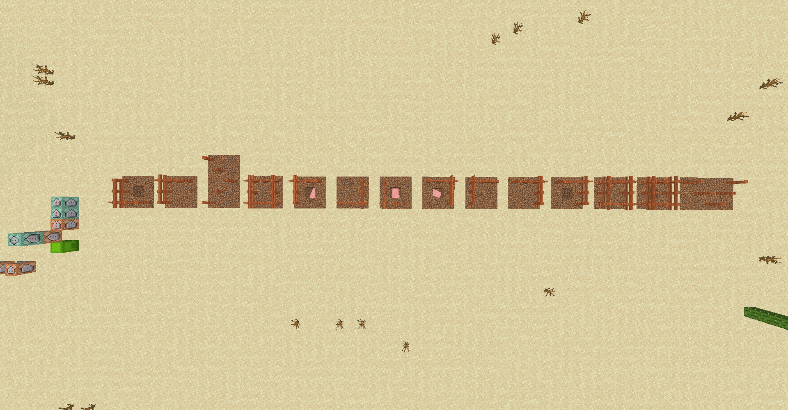

# Modest Cipher

Minecraft 

### Description
Just couldn't resist... 
[challenge source](https://gist.github.com/AndyNovo/aeb71c1d912cc64ad127c36682202ec2) 
Our mc86 problems introduce a new vanilla Minecraft CPU (java edition). 
It helps to have Java Edition Minecraft but if you don't they can still be solved the old fashioned way. 
Here is a video introducing the architecture and the book to build the CPU: 
[mc86 Intro on YouTube](https://www.youtube.com/watch?v=mqOSgJ0NM_Q) 
[mc86 init book](https://gist.github.com/AndyNovo/657ff15b7614f70e34f7295cb3dd7a8f) 
Authors: Izzy and ProfNinja

   

### Solution
Running the code gives us a structure 
 
It is a pigpen cipher 
Decoding it gives us the flag 
 
> UDCTF{LITERALPIGPENS}