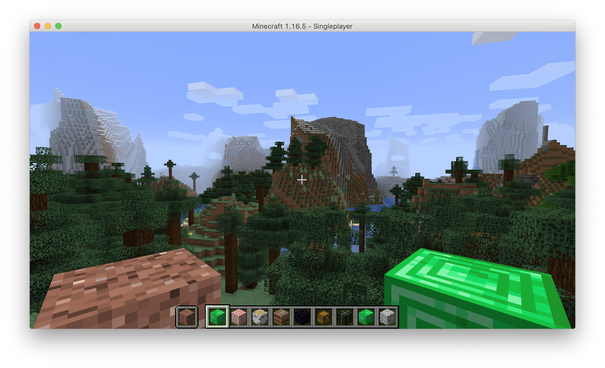
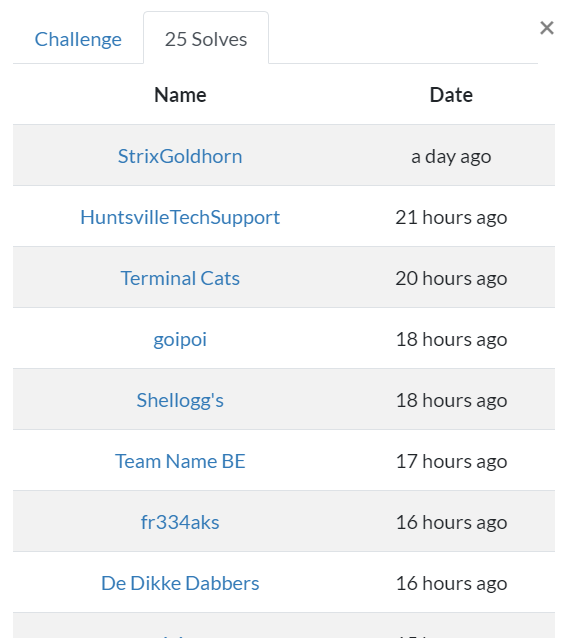
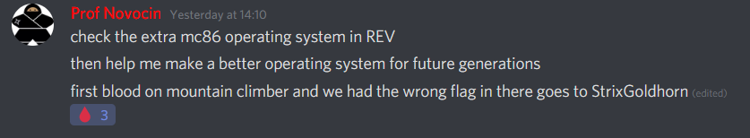

# Mountain Climber

Minecraft 

### Description
descWrap your result in UDCTF{} all caps. 
Author: Izzy 
[File](./Assets/mc.png)

   

### Solution
 
Using my epic minecrafting gamer knowledge, we notice that the inventory is filled with junk blocks 
Taking the first letter of each block in the inventory gives us the flag 
 
> UDCTF{GETBLOCKED}

 

### Obligatory bragging rights
My first first-blood is on a minecraft-related challenge lol  
 
 