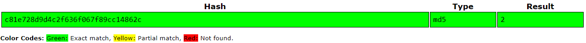

# Speedrun 1

Web 

### Description
[challenges.ctfd.io:30025](challenges.ctfd.io:30025)

   

### Solution
We enter the site and see that there is a cookie, titled `PHPSESSID`, with a value of `c81e728d9d4c2f636f067f89cc14862c` 
Using [crackstation.net](crackstation.net), we decode it and find out that it is an md5 hash with value of 2  
 
We then generate an md5 hash with a value of 1, ie: `c4ca4238a0b923820dcc509a6f75849b` 
We set it as the cookie, and viola, we get the flag 
 
> UDCTF{d0nt_r0ll_your_0wn_s3ssions}