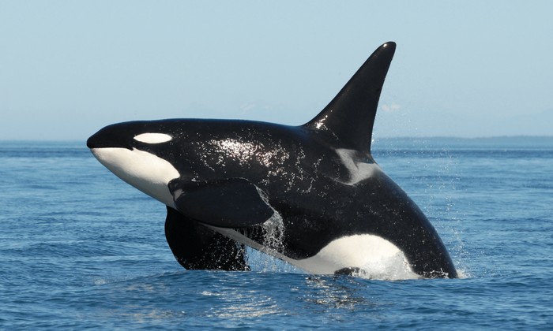

# misc/LSBlue
### wooshi

## Description
Orca watching is an awesome pastime of mine!
### Downloads
[lsblue.png](Assets/LSBlue/lsblue.png)  
 

## Solution
1. We go to https://stegonline.georgeom.net/image and browse bit plane
2. Something seems interesting on plane Blue 0
3. We extract data from plane Blue 0, to get the flag

> flag{0rc45_4r3nt_6lu3_s1lly_4895131}