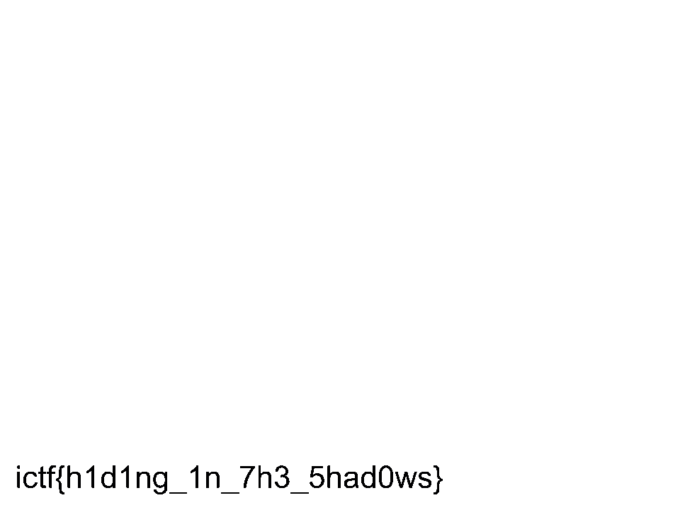

# Forensics/Void
### FIREPONY57

## Description
No one can find me in the void right?

 

## Solution
- We used the `Fill` function in an art program `FireAlpaca`, and clicked on a random space

- Voila, we get the flag

 

> ictf{h1d1ng_1n_7h3_5h4d0ws}