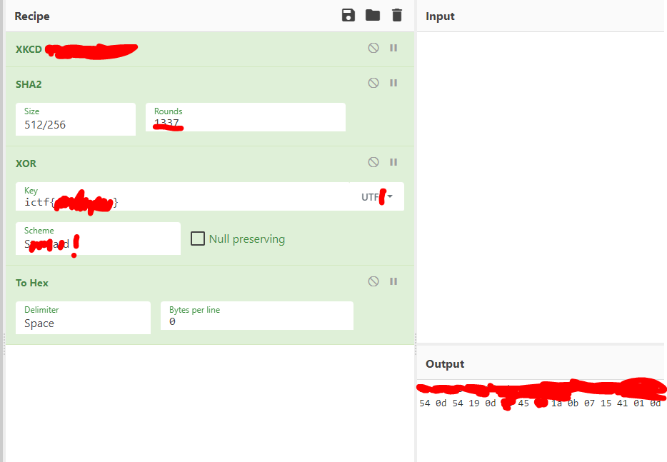
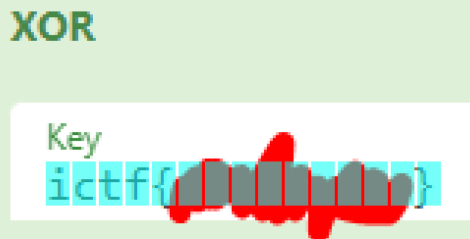

# Misc/Redacted

### Eth007

## Description

Everyone's favorite tool... Can you fill in the blanks?

 

## Solution

- The cells used were:
  1. `XKCD Random Number`,
  2. `SHA2` set with size `512/256` and `1337` rounds,
  3. `XOR` with `UTF8` key and `Standard` scheme,
  4. `To Hex`

- With some guesswork, we can guess that the flag is 15 chars long

     

- By inputting `ictf{aaaaaaaaa}`, we can match the keylength, and search for matching hex values in the output to the unredacted portions in the image given

- After matching `ictf{` to `0d ██ 45 ██ 1a`, we can continue making educated guesses from there to get the flag

> ictf{n0tr4ndom}
