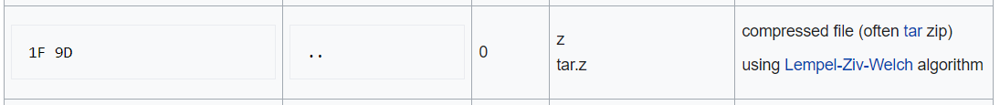

# Buzz

Warmups 
1393 solves, 50 pts 

### Description
You know, that sound that bumblebees make? 
[File](./Assets/buzz)

   

### Solution
We search the file signature and realise it is a tar.z archive  
  
We then used 7zip to extract it 
Using a hex editor to view the extracted file, we get the flag 
 
> flag{b3a33db7ba04c4c9052ea06d9ff17869}