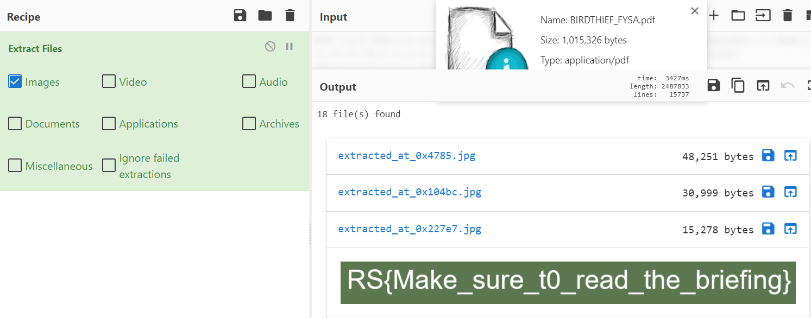

# BIRDTHIEF: FYSA

Forensics 
254 solves, 100 pts 

### Description
[File](./Assets/BIRDTHIEF/BIRDTHIEF_FYSA.pdf)

   

### Solution
We load it in CyberChef and extract files, specifically images 
We find the flag in one of the images  
 
 
> RS{Make_sure_t0_read_the_briefing}