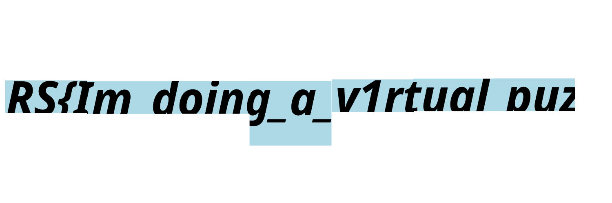

# Parcel

Forensics 
176 solves, 200 pts 

### Description
That's a lot of magick 
~knif3 
[File](./Assets/Parcel/Parcel_original)

   

### Solution
We extract the gzip file to obtain this [file](./Assets/Parcel/Parcel) 
We notice a lot of base 64 encoded images in the file 
Hence, we copied and converted the larger chunks of base 64 encoded images 
We realise that it is a bunch of pieces to an image of a string 
Hence, we reassemble it with what we have, using Medibang Paint Pro  
 
 
> RS{Im_doing_a_v1rtual_puzzl3}