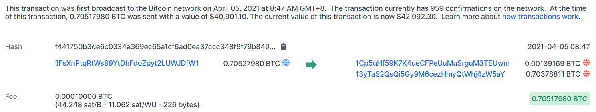

# APT Interference

OSINT 
90 solves, 300 pts 

### Description
Geno’s ex is speculated to be involved in his disappearance. Try to find some incriminating information on her social media. 
What nation-state is she working with? (Wrap the answer in RS{}) 
Author: t0uc4n 

   

### Solution
From her [twitter account](https://twitter.com/eng_claire), we find a bitcoin address `13yTaS2QsQi5Gy9M6cezHmyQtWhj4zW5aY` 
Searching up the history, we find a transation of 0.70527980 BTC to the address `1FsXnPtqRtWs89YtDhFdoZpyt2LUWJDfW1`  
  
Searching the address on google, we find that it is the Bitcoin wallet of [Ackaria's Ministry of Finance](https://finance.ackaria.xyz/) 
 
> RS{Ackaria}