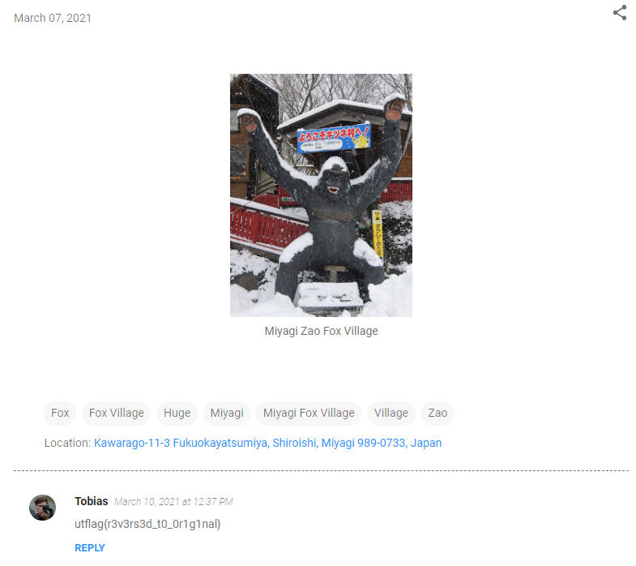

# OSINT Part 2

Forensics 
154 solves, 766 pts 

### Description
Find the origins of the linked file found in part 1. 
by Rob H 

   

### Solution
We copy the filename of the image and search it on Google  
It reveals a [blog](https://tobiasmaier.blogspot.com/2021/03/blog-post_6.html) 
In the blog, there is a comment with the flag  
 
 
> utflag{r3v3rs3d_t0_0r1g1nal}
