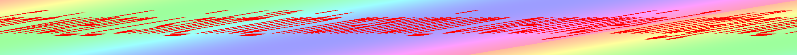
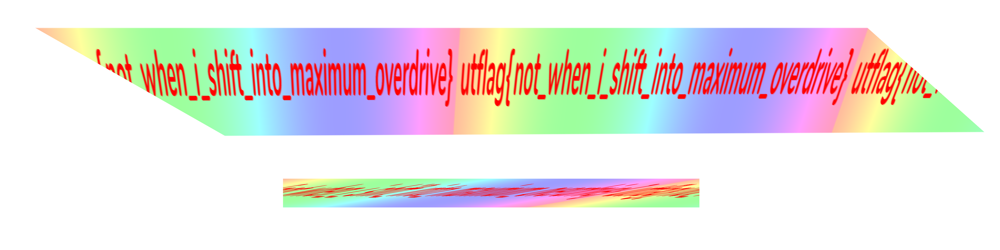

# SHIFT

Forensics 
265 solves, 304 pts 

### Description
I just tried to download this flag, but it looks like the image got messed up in transit... 
by balex 
 
[File](./Assets/SHIFT.png)

   

### Solution
We used MediBang Paint Pro, to join 2 of the images together 
Then, we used the free transform function to stretch it to a readable image 
 
 
> utflag{not_when_i_shift_into_maximum_overdrive}