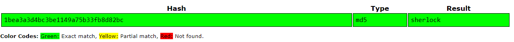

# Source it!

Web<br/>
576 solves, 100 pts<br/>

### Description
Can you see how this page handles authentication?<br/>
http://web1.utctf.live:8778<br/>
by Rob H<br/>

<br/><br/><br/>

### Solution
We view the source code of the website to find a piece of interesting code:<br/>
````
<script> 
    function checkPassword(form) { 
        password1 = form.password1.value; 
        name = form.name.value;
        var username = "admin";
        var hash = "1bea3a3d4bc3be1149a75b33fb8d82bc"; 
        var hashedPasswd = CryptoJS.MD5(password1);

        if (password1 == '') 
            alert ("Please enter Password"); 
        
        else if (username != name) { 
            alert ("\nYou lack access privlages...") 
            return false; 
        }
                
        else if (hash != hashedPasswd) { 
            alert ("\nIncorrect password...") 
            return false; 
        } 

        else{ 
            alert("Access Granted\n" + text) 
            return true; 
        } 
    } 
</script>
````
We use crackstation to get the plaintext of the md5 hash, which is “sherlock”<br/><br/>
<br/><br/>
We login with “admin” as username, and “sherlock” as password, to get the flag<br/>
<br/>
> utflag{b33n_th3r3_s0uRc3d_th4t}
