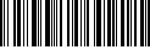

# Barcode Scanner

Forensics 
447 solves, 103 pts 

### Description
My phone is not recognizing this barcode. Can you give it a try?
[File](./Assets/image.jpg)

   

### Solution
We use StegOnline to inverse the image and scan it to get the flag  
  
 
> vishwaCTF{5oo_3asY}