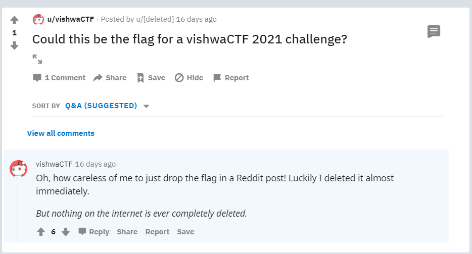
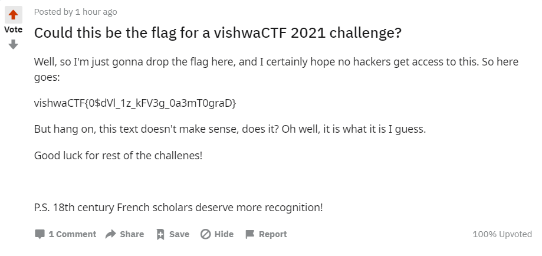

# Front Pages

General 
39 solves, 493 pts 

### Description
Cover pages or front pages of newspapers and magazines contain the biggest news stories and are designed to grab a person's attention. 
BTW, did you know that the internet has a front page too? 
Flag Format is same : vishwaCTF{} 

   

### Solution
Note: This was basically a simple OSINT challenge 
First, we should note that reddit describes itself as the front page of the internet 
Hence, we google “vishwaCTF” site:reddit.com 
We find that there is a user [u/vishwaCTF](https://www.reddit.com/user/vishwaCTF/comments/), and he had [an interesting post](https://www.reddit.com/user/vishwaCTF/comments/lt1gzm/could_this_be_the_flag_for_a_vishwactf_2021/gouffbd/?context=3) 
  
Next, we find out that the post was archived in the [wayback machine](https://web.archive.org/web/20210226174949/https://www.reddit.com/user/vishwaCTF/comments/lt1gzm/could_this_be_the_flag_for_a_vishwactf_2021/) 
 

> vishwaCTF{0$dVl_1z_kFV3g_0a3mT0graD} … P.S. 18th century French scholars deserve more recognition! 

An old french cipher was the Vigenere Cipher 
At first, automatic decryption on dcode.fr did not yield any results 
However, we guessed and changed the key to vishwaCTF, and viola, we have the flag 

 
> vishwaCTF{0$iNt_1s_oFT3n_0v3rL0okeD}