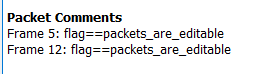

# Commenting is the key

Networking 
383 solves, 151 pts 

### Description
Silicom tried communicating with Castlene and then they made some comments about it... try to find the flag through this file 
[File](./Assets/question.pcapng)

   

### Solution
On the bottom left corner, click open capture file properties dialog 
Read comments to get flag 
 
 
> vishwaCTF{packets_are_editable}