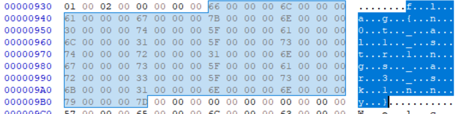

# rev/wstrings
### NotDeGhost

## Description
Some strings are wider than normal...

[wstrings](Assets\wstrings)

## Solution
Opening the file in a hex editor, we can see the flag is separated by a bunch of empty characters 
 
Removing them gives us the flag

> flag{n0t_al1_str1ngs_ar3_sk1nny}